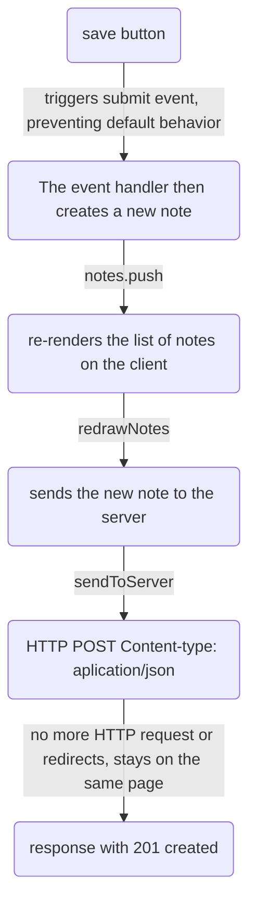

```mermaid
flowchart TD
A(save button) -->|triggers submit event, preventing default behavior | B(The event handler then creates a new note)
B --> |notes.push| C(re-renders the list of notes on the client)
C--> |redrawNotes| D(sends the new note to the server)
D --> |sendToServer| E(HTTP POST Content-type: aplication/json)
E --> |no more HTTP request or redirects, stays on the same page|G(response with 201 created)
```
